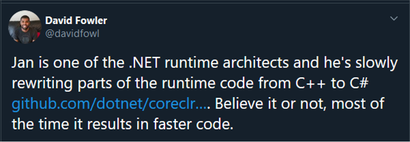

<!-- _header: '' -->
<!-- _paginate: false -->

<style scoped>
a {
  text-decoration: none;
  color: inherit;
}
</style>

## .NET Core & Linux

### Fabio Di Peri

###### [fabio@kipters.dev](mailto:kipters.dev)
###### [Twitter: @kipters](https://twitter.com/kipters)
###### [Telegram: @kipters](https://t.me/kipters)


---

<!-- _class: lead  -->

> I went into .NET thinking this was a programming language, but it seems I&#39;ve stumbled upon a mini operating system with support for multiple execution environments, programming languages, and now I have so many questions.
&mdash; Kelsey Hightower (@kelseyhightower) [July 30, 2020](https://twitter.com/kelseyhightower/status/1288693463022620672)

<br>
<br>
<br>
<br>
<br>

---

# Multiple execution environments

- .NET Framework
- .NET Core
- Mono
- .NET Micro
- .NET Nano
- CoreRT

---

# Multiple languages

- C#
- F#
- VB

---

# Multiple languages

- C#
- F#
- VB
- C++
- Python
- PHP
- ...

---

<!-- _class: lead invert -->

# Codice :arrow_right: CIL :arrow_right: CLR :arrow_right: ⚡️

---

<!-- _class: lead invert -->

## Codice :arrow_right: CIL :arrow_right: CLR :arrow_right: ⚡️
# Java :arrow_right: bytecode :arrow_right: JVM :arrow_right: ⚡️

---

# CLR | Common Language Runtime
### "La JVM"

- CLR
- Mono
- CoreCLR

---

# BCL | Base Class Library

L'intero set di librerie e classi a disposizione delle applicazioni .NET

---

# Nuget

<style scoped>
img {
  display: block;
  margin-right: auto;
  width: 70%
}
</style>


---

# dotnet CLI

<style scoped>
img {
  display: block;
  margin-right: auto;
  width: 60%
}
</style>


---

# 1995
## Java


--- 

# 1996
## Anders Hejlsberg


---

# 1996
## Anders Hejlsberg


Turbo Pascal
Delphi

---

# 1996
## Anders Hejlsberg


Turbo Pascal
Delphi
**C#**
**TypeScript**

---

<!-- _class: lead invert -->
# Visual J++ 1.1


---

<!-- _class: lead invert -->

# Visual J++ 6.0


---

# Visual J++ 1.x

**Abbraccia** Java

---

# Visual J++ 6.0

**Abbraccia** Java

**Estende** Java (con le Windows Foundation Classes + estensioni)

---

# Visual J++

**Embrace** Java

**Extend** Java (con le Windows Foundation Classes + estensioni)

*???*

---

<!-- _class: lead invert -->

# Sun Microsystems fa causa a Microsoft

---

<!-- _class: lead invert -->

# Visual J++ viene dismesso

---

# Tre problemi da risolvere

- Runtime
  - Troppi linguaggi con runtime separati: vanno unificati
- Linguaggi
  - (Windows) Base Class Libraries, un set unificato di librerie
- Web
  - "Portare la OOP sul web"

---

<!-- _class: lead invert -->

## Scott Guthrie


---

# PDC 2000
## Next generation Windows services

---

# PDC 2000
## Next generation ~~Windows~~ Web Services

---

# PDC 2000
## Next generation ~~Windows~~ Web Services
### Una nuova piattaforma su standard aperti

- ECMA-334 (C#)
- ECMA-335 (CLR | Common Language Runtime)

---

<!-- _class: lead invert -->

# Nasce ufficialmente .NET

---

<!-- _class: lead invert -->

## Miguel de Icaza


---

<!-- _class: lead invert -->

## Miguel de Icaza

Midnight Commander
GNOME
Gnumeric


---

<!-- _class: lead invert -->

## Nat Friedman


CEO di Ximian
CEO di Xamarin
CEO di GitHub

---

<!-- _class: -->

# 2001


---

<!-- _class: lead invert -->

>Mono is a free and open-source project to create an Ecma standard-compliant .NET Framework-compatible software framework, including a C# compiler and a Common Language Runtime.
&mdash; [Wikipedia](https://en.wikipedia.org/wiki/Mono_(software))

---

<!-- _class: invert -->

# PDC | Ottobre 2001

## Prima release candidate di .NET 1.0


---

# Febbraio 2002

## Visual Studio .NET 
### Include .NET 1.0 e C# 1.0

>22 languages, one platform

---

# Marzo 2002

## Project Rotor

>Shared source implementation of CLR

Include runtime, BCL e compilatore C#

---

# Marzo 2002

## Project Rotor

>Shared source implementation of CLR

Include runtime, BCL e compilatore C#

Non è open source, è una licenza accademica

---

# Aprile 2003

## .NET 1.1

---

# Giugno 2004

## Mono 1.0

---

# Novembre 2005

## .NET 2.0

- CLR 2.0
- C# 2.0

---

# Novembre 2006

## .NET 3.0

- CLR 2.0
- C# 3.0

## Mono 1.2

---

# Settembre 2007

## Silverlight

Per la prima volta .NET supporta ufficialmente un OS diverso da Windows (Mac OS X)

---

# Ottobre 2007

## "Scott Guthrie's ninja army"

Persone di alto profilo, coinvolte nell'open source

---

# Ottobre 2007

## alt dot net

Community per spingere l'open source tra gli utenti di tecnologie Microsoft

Scott Guthrie apre il keynote della prima conferenza

Demo pubblica di <span>ASP.NET<span> MVC (rilasciato poi sotto MS-PL)

---

# Novembre 2008

## .NET 3.5

- LINQ.
  Il resto non importa. LINQ.

## Mono 2.0

- In pari con .NET 2.0 (e C# 3.0)
- Cecil e Gtk#
- Annunciato Moonlight

---

# Marzo 2010
## iPad

---

# Marzo 2010
## iPad

Steve Jobs: "Thoughts on Flash"

---

# Settembre 2009
## MonoTouch 1.0, .NET su iOS

---

# Aprile 2011
## Mono for Android
## Nasce Xamarin

---

# 2011
## Roslyn

### Un nuovo compilatore per C# e VB, scritto in C#

---

# //Build/ | Aprile 2014

- Viene annunciata la .NET Foundation
- Xamarin, Microsoft e altri cedono codice alla .NET Foundation
- <span>ASP.NET</span> MVC, Entity Framework, Roslyn e altri componenti vengono rilasciati sotto licenza Apache 2.0

---

# //Build/ | Aprile 2014

- Viene annunciata la .NET Foundation
- Xamarin, Microsoft e altri cedono codice alla .NET Foundation
- <span>ASP.NET</span> MVC, Entity Framework, Roslyn e altri componenti vengono rilasciati sotto licenza Apache 2.0
<br>
- Viene annunciato Visual Studio Code
- Viene rilasciato TypeScript 1.0

---

# Connect(); 2014 | Ottobre 2014

---

<!-- _header: '' -->


---

# Connect(); 2014 | Ottobre 2014

### .NET Core viene rilasciato sotto Apache 2.0, incluso:

- CLR
- JIT
- Garbage Collector
- BCL

>"This includes everything necessary to execute .NET code"
&mdash; Scott Guthrie

---

<!-- _header: '' -->


---

<!-- _header: '' -->


---

<!-- _header: '' -->


---

# 2016
## Microsoft acquisisce Xamarin
- Xamarin.iOS, Xamarin.Android, Xamarin.Mac e Xamarin.tvOS rilasciati sotto Apache 2.0

---

<!-- _class: lead invert -->

# Oggi

---

<!-- _header: '' -->


---

<!-- _header: '' -->


---

<!-- _header: '' -->


---

<!-- _header: '' -->


---


---

<!-- _header: '' -->


---

<!-- _header: '' -->




---


---


---


---


---

<!-- _class: lead invert-->

```csharp
public static decimal CalculateToll(object vehicle) =>
    vehicle switch
    {
       ...
       
        DeliveryTruck t when t.GrossWeightClass > 5000 => 10.00m + 5.00m,
        DeliveryTruck t when t.GrossWeightClass < 3000 => 10.00m - 2.00m,
        DeliveryTruck _ => 10.00m,

        _ => throw new ArgumentException("Not a known vehicle type", nameof(vehicle))
    };
```

---

<!-- _class: lead invert -->

# Demo

---

# Links

<style scoped>
a {
  text-decoration: none;
  color: inherit;
}
</style>

- [dot.net](https://dot.net)
- [try.dot.net](https://try.dot.net)
- [Slides: kipte.rs/ld2020-slides](http://kipte.rs/ld2020-slides)
- [Demo: kipte.rs/ld2020-demo](http://kipte.rs/ld2020-demo)
- [.NET org](https://github.com/dotnet)
- [M.A.U.I.](https://github.com/dotnet/maui)
- [Uno Platform](https://github.com/unoplatform)
- [Blazor](https://dotnet.microsoft.com/apps/aspnet/web-apps/blazor)
- ["What is .NET?"](https://www.youtube.com/watch?v=bEfBfBQq7EE)

--- 

# People

<style scoped>
a {
  text-decoration: none;
  color: inherit;
}
</style>

- [David Fowler @davidfowl](https://twitter.com/davidfowl)
- [Michal Strehovský @MStrehovsky](https://twitter.com/MStrehovsky)
- [Stephen Toub @stephentoub](https://github.com/stephentoub)
- [Jeremy Sinclair @sinclairinat0r](https://twitter.com/sinclairinat0r)

---

<!-- class: lead -->

# Grazie per l'attenzione!

---

# Domande?
